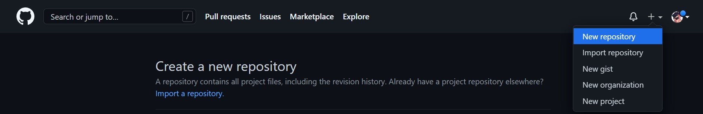
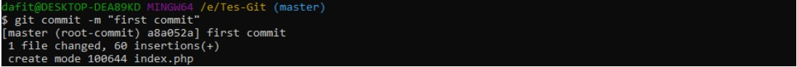

# Latihan_Vcs

## Instalasi Git

1. Download File Git

Untuk menginstall Git, Anda perlu mengunduh file-nya terlebih dahulu di situs resminya. Download sesuai tipe sistem operasi pada komputer Anda. Apabila tipe sistem operasi komputer Anda 64bit,  pilih Git yang mendukung Windows 64bit. Tujuannya adalah agar tidak terjadi error saat proses instalasi Git.

2. Install Git

Setelah selesai mengunduh file Git, buka setup aplikasi Git untuk memulai proses instalasi. Halaman awal setelah Anda membuka setup aplikasi Git adalah tampilan Document License dari Git. Klik Next untuk melanjutkan instalasi.

3. Tentukan Lokasi Instalasi Git

Selanjutnya, pilih lokasi untuk install Git pada komputer Anda. Pada tutorial ini kami menginstall di lokasi C:\Program Files\Git. Setelah menentukan lokasi instalasi Git, klik Next untuk melanjutkan .

4. Pilih Komponen Tambahan

Kemudian pilih komponen tambahan untuk install Git. Fungsi komponen ini adalah untuk memperlancar penggunaan Git dan mendukung file dengan kapasitas besar. Sesuaikan komponen tambahan yang dipilih seperti pada gambar di bawah ini. Jika sudah klik Next untuk melanjutkan instalasi.

5. Tentukan Nama Aplikasi Git

Sebenarnya Anda bebas mengganti nama aplikasi Git yang akan ditampilkan pada Start Menu. Akan tetapi, demi kemudahan saat mencari aplikasi ini, sebaiknya gunakan nama Git saja.

6. Tentukan File Editor

Untuk mengedit script melalui Git, Anda memerlukan file editor. Anda bebas menggunakan file editor apa pun untuk dikombinasikan dengan Git. Pada tutorial ini, kami menggunakan Vim Editor. Klik Next apabila Anda sudah menentukan file editor yang akan Anda gunakan.

7. Atur Path Environment

Selanjutnya adalah pengaturan Path Environment. Path Environment berfungsi untuk mengeksekusi perintah perintah pada Git. Pilih Git from the command line and also from 3rd-party software agar saat menjalankan perintah Git dapat dikenali di Command Prompt (CMD) pada Windows.

8. Pilih Aplikasi SSH

Kemudian untuk mengeksekusi SSH, Anda bisa menggunakan aplikasi dari Git atau  dari platform lain seperti PuTTY dan Bitvise. Pada tutorial ini kami menggunakan Use OpenSSH, aplikasi default SSH dari Git. Klik Next untuk melanjutkan instalasi.

9. Pilih Line Ending

Selanjutnya, Anda perlu memilih pengaturan line ending. Pada tutorial ini kami memilih Checkout Windows-style, commit Unix-style line endings. Klik Next untuk melanjutkan instalasi.

10. Pilih Emulator Terminal

Setelah itu, Anda perlu memilih emulator terminal yang akan digunakan. Anda bisa menggunakan Command Prompt atau MinTTY. Karena ingin menggunakan Command Prompt, pada tutorial ini kami memilih Use Windows default console windows. Klik Next untuk melanjutkan instalasi.

11. Tentukan Opsi ekstra

Terdapat beberapa opsi ekstra yang bisa Anda pilih. Pertama, pilih Enable File System Caching agar Git memiliki fungsi system caching. Kedua, pilih Enable Git Credential Manager agar Git bisa dikombinasikan dengan aplikasi lain seperti Visual Studio, Android Studio, dan GitHub. Klik Next untuk melanjutkan instalasi.

12. Mulai Proses Instalasi

Setelah menambahkan konfigurasi ekstra pada Git, Anda bisa memulai proses instalasi Git. Klik Install untuk melanjutkan proses.

Berikut ini adalah tampilan proses instalasi Git. Tunggu hingga proses selesai dan Anda bisa menggunakan Git pada Windows.

13. Cek Versi Git

Setelah proses instalasi selesai, Anda perlu mengecek apakah instalasi Git berhasil atau tidak. Anda bisa mengeceknya melalui Command Prompt. Klik Win+R lalu ketik CMD untuk membuka Command Prompt seperti di bawah ini.

Selanjutnya masukkan perintah berikut untuk cek versi git dan cek apakah Git sudah terinstall di komputer Anda.
git --version
Jika Git berhasil terinstall, Anda akan melihat tampilan seperti di bawah ini yang menunjukkan versi Git. 

## Cara Menggunakan Git
Setelah berhasil install ke Git, selanjutnya kami akan memberikan 10 langkah menggunakan Git. Berikut ini adalah sembilang langkah menggunakan Git.

1. Login Git
Untuk login ke Git, Anda bisa menggunakan akun GitHub, Gitlab, atau Bitbucket. Jika belum memiliki akun dari ketiga platform tersebut, Anda bisa mendaftarkan diri terlebih dahulu. Selanjutnya Anda bisa melakukan login awal pada Git  menggunakan Command Prompt  (Windows) atau Command Line (Linux) . Kemudian masukkan perintah-perintah yang akan kami jelaskan di bawah ini.

Selanjutnya, masukkan username GitHub Anda menggunakan perintah di bawah ini. Lalu tekan ENTER jika sudah benar.

$ git config --global user.name "UsernameAnda"
Kemudian masukkan email yang terdaftar di GitHub Anda menggunakan perintah di bawah  ini. Lalu tekan ENTER jika sudah benar.

$ git config --global user.email IsiDenganEmailAnda@gmail.com
Selanjutnya untuk memastikan proses login Anda berhasil, masukkan perintah berikut.

$ git config --list

2. Login Github
Langkah kedua dalam belajar menggunakan Git adalah Anda harus login ke dalam website GitHub. Github dan Git memiliki hubungan khusus, yaitu Git yang berperan sebagai version control system dan Github menjadi hosting atau sebagai penyimpan kode pemrograman.

Setelah Anda login, akan muncul tampilan dashboard dari GitHub seperti  gambar di bawah ini.

3. Buat Repository
Setelah berhasil login ke GitHub, Anda bisa mulai membuat repository. Klik tombol New pada menu Repositories untuk membuat repository baru.

Kemudian Anda akan diarahkan pada halaman untuk membuat repository baru seperti gambar di bawah ini.

Anda perlu mengisi detail informasi berikut:

-Nama Repository : digunakan untuk identitas repository yang dibuat.
- Deskripsi Repository : berfungsi untuk deskripsi dari repository yang dibuat.
- Jenis Repository   : jenis repository  dibagi menjadi Public dan Private. Ketika Anda mengatur repository menjadi Public, orang lain dapat melihat repository yang Anda -buat. Sebaliknya, jika Anda mengaturnya sebagai Private, repository tersebut hanya bisa diakses oleh Anda.
- Setelah mengisi detail informasi di atas, klik Create Repository.

4. Buat Folder pada Windows
Selanjutnya, Anda perlu membuat folder pada local disk komputer Anda. Fungsinya adalah untuk menyimpan update file dari repository GitHub yang telah Anda buat.

5. Buka Folder Menggunakan Git Bash

Setelah berhasil membuat folder pada local disk komputer Anda,  buka folder tersebut dengan cara klik kanan lalu pilih Git Bash Here. Setelah itu, Command Prompt akan muncul seperti di bawah ini. 

6. Ubah Folder Menjadi Repository
Setelah itu, ubah folder tersebut menjadi repository menggunakan perintah berikut:

$ git init

7. Tambahkan File ke Repository
Untuk bisa menambahkan file ke repository GitHub, Anda perlu menerapkan langkah-langkah di bawah ini:

- Buat file di folder yang sudah dibuat (Test Git). Contohnya, di sini kami membuat file index.php
- Buka GitBash lalu masukkan perintah berikut:
$ git add index.php
Perintah tersebut tidak akan menghasilkan output apa pun.

8. Buat Commit 
Selanjutnya, Anda perlu membuat Commit. Commit berfungsi untuk menambahkan update file serta komentar. Jadi setiap kontributor bisa memberikan konfirmasi update file di proyek yang sedang dikerjakan. Masukkan perintah berikut untuk membuat Commit:

$ git commit -m "first commit"
Pada tutorial ini kami membuat first commit sebagai Commit pertama kami. Anda bebas membuat membuat nama Commit apa saja.

9. Remote Repository Github
Remote repository berfungsi untuk mengupload file yang telah Anda buat sebelumnya di local disk. Masukkan perintah berikut ini untuk melakukan remote repository:

$ git remote add origin git@github.com:UserNameGit/NamaRepository.git
Perintah di atas tidak akan menghasilkan output apa pun.

10. Push ke GitHub 
Langkah terakhir adalah push ke GitHub Push ini berfungsi untuk mengupload hasil akhir dari langkah-langkah di atas. Masukkan perintah berikut untuk melakukan push ke GitHub:

git push -u origin master
Perintah di atas akan menampilkan pop up sign in GitHub. Anda perlu login untuk melanjutkan proses push ke GitHub. 

Jika proses login berhasil, akan muncul tampilan Command Prompt seperti di bawah:

11. Cek File
Setelah itu, cek repository yang telah Anda buat. Anda akan mendapati file-file yang telah ditambahkan sebelumnya. 

## Kesimpulan
Cara menggunakan Git ini wajib diketahui dan dikuasai oleh semua developer karena akan sangat membantu dalam mengerjakan project pembuatan website.
Demekian yang saya bisa paparkan, kuranglebihnya saya mohon maaf, dan saya berharap semoga para pembaca bisa mengambil maanfaat dari sini,
Sekian dan thank u, Wassalamu'alaikum warohmatullohi wa barakaatuh.
